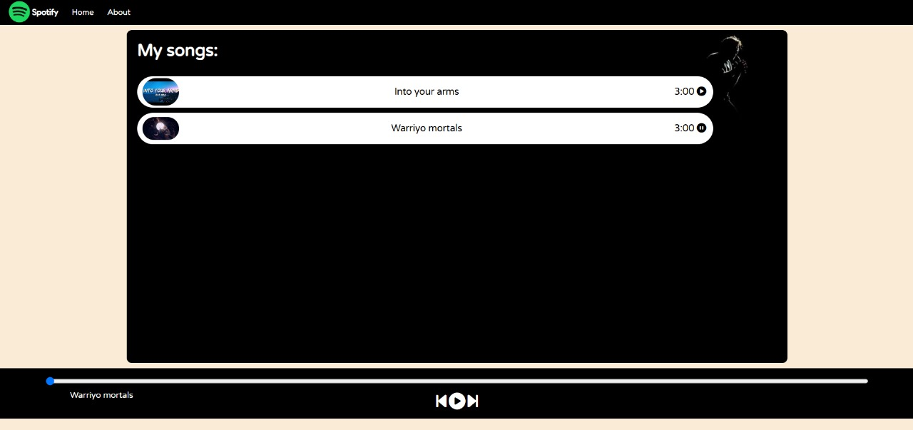

# 🎵 Simple Spotify Clone

A lightweight music player with basic Spotify-like controls.

[Live Demo]([https://your-site-name.netlify.app](https://candid-brioche-049edc.netlify.app/)) 

## Features
- Play/pause songs
- Switch between tracks
- Clean, responsive design
- Volume control

## How to Use
1. **Online**: Visit the [Live Demo](https://your-site-name.netlify.app)
2. **Locally**:
   - Download the files
   - Open `index.html` in your browser

## Built With
- HTML
- CSS (with Bootstrap)
- JavaScript

## Future Plans
- Add more songs
- Improve player controls
- Add playlist feature

 
